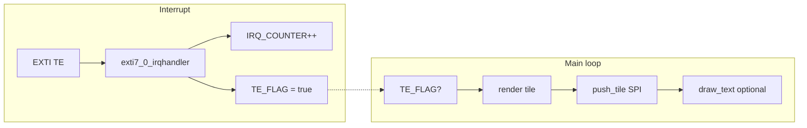

# Architecture

## Platform

- **MCU:** WCH CH32V003 family (RISC-V `riscv32imc`, QingKe V2 core as used with this target).
- **Toolchain:** `no_std`, no allocator; crates: `panic-halt`, `semihosting` (stdio for debug prints).
- **Assembly listings:** `cargo gen-asm` (release) and `cargo gen-asm-dev` (dev + `.loc`) emit `.s` files for studying RISC-V codegen — see [README.md](README.md#riscv-assembly-listings).
- **Link layout:** Custom `memory.x` (see [memory.md](memory.md)); build target `riscv32imc-unknown-none-elf`.

## Module layout

| Module | Role |
|--------|------|
| `main` | Entry, game loop, TE flag handling, tile render orchestration, IRQ counter + semihosting log |
| `regs` / `rcc` | WCH register map; **48 MHz HSE+PLL** clock init |
| `hw` | GPIO (board pins), **SPI1 @ 24 MHz**, **DMA1 ch3** TX, **TIM1 CH1 PWM** backlight on **PD2**, delays |
| `ili9341` | C-style init table, **DMA** `fill_rectangle` / `push_solid_tile`, TE on |
| `font` | Minimal bitmap text (`draw_char` / `draw_text`) over SPI |

There is **no** separate board-support package: **`hw::platform_init()`** (called from `ili9341::init`) configures RCC, GPIO, SPI1, and DMA. Backlight comes up at full brightness via **`backlight_on()`** → **TIM1** PWM on **PD2** (~47 kHz; duty **`0..=1023`**, max **1023** — see [hardware.md](hardware.md#backlight-pwm-pd2--tim1_ch1)). **EXTI/NVIC for TE on PD0** is still TODO in the IRQ handler.

## Graphics pipeline

1. The display is treated as a **6×8 grid** of **40×40** RGB565 tiles (48 tiles total). `Tiles` holds a `dirty[48]` mask.
2. When the **TE / EXTI** path runs, the main loop clears the flag, optionally logs `IRQ_COUNTER` via semihosting, picks the next dirty tile, computes a **solid RGB565 color**, and **`push_solid_tile`** (SPI **DMA**, no tile RAM buffer — same idea as the C driver’s `ili9341_fill_rectangle`).
3. A simple **“HELLO”** overlay uses `font::draw_text`, which rasterizes into a small static buffer and **DMA**-streams pixels.

## Interrupts

- `exti7_0_irqhandler` matches the WCH naming for the **EXTI line 7–0** IRQ. On this board the panel **TE** signal is wired to **PD0** (see [hardware.md](hardware.md)).
- The handler only bumps a counter and sets `TE_FLAG`; **EXTI pending clear** is left as a TODO in source (“platform specific”).

## Debug output

- `semihosting::println!` sends text to the **host debugger** when RISC‑V semihosting is enabled. It is **not** UART. If no debugger handles semihosting, output may be missing or behavior may depend on your probe.
