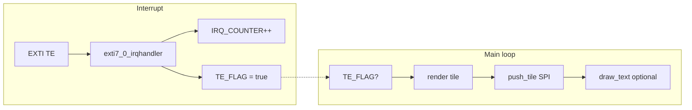

# Architecture

## Platform

- **MCU:** WCH CH32V003 family (RISC-V `riscv32imc`, QingKe V2 core as used with this target).
- **Toolchain:** `no_std`, no allocator; crates: `panic-halt`, `semihosting` (stdio for debug prints).
- **Link layout:** Custom `memory.x` (see [memory.md](memory.md)); build target `riscv32imc-unknown-none-elf`.

## Module layout

| Module | Role |
|--------|------|
| `main` | Entry, game loop, TE flag handling, tile render orchestration, IRQ counter + semihosting log |
| `hw` | Low-level **SPI1** byte TX (register polling); **GPIOC** BSHR for **CS (PC1)**; **GPIOD** BSHR for **D/C (PD3)** and **RST (PD4)** |
| `ili9341` | Panel init (16-bit RGB565), set address window, push 40×40 tiles |
| `font` | Minimal bitmap text (`draw_char` / `draw_text`) over SPI |

There is **no** RCC or GPIO mode configuration in this repository: the code assumes SPI1 and the chosen GPIO pins are already set up (mux, speed, push-pull) by your board support, bootloader, or an init block you add.

## Graphics pipeline

1. The display is treated as a **6×8 grid** of **40×40** RGB565 tiles (48 tiles total). `Tiles` holds a `dirty[48]` mask.
2. When the **TE / EXTI** path runs, the main loop clears the flag, optionally logs `IRQ_COUNTER` via semihosting, picks the next dirty tile, **renders** into a RAM buffer, **pushes** that tile with `Ili9341::push_tile`, then clears the dirty bit.
3. A simple **“HELLO”** overlay uses `font::draw_text`, which issues many small SPI transactions (per pixel column/row pattern).

## Interrupts

- `exti7_0_irqhandler` matches the WCH naming for the **EXTI line 7–0** IRQ. On this board the panel **TE** signal is wired to **PD0** (see [hardware.md](hardware.md)).
- The handler only bumps a counter and sets `TE_FLAG`; **EXTI pending clear** is left as a TODO in source (“platform specific”).

## Debug output

- `semihosting::println!` sends text to the **host debugger** when RISC‑V semihosting is enabled. It is **not** UART. If no debugger handles semihosting, output may be missing or behavior may depend on your probe.
